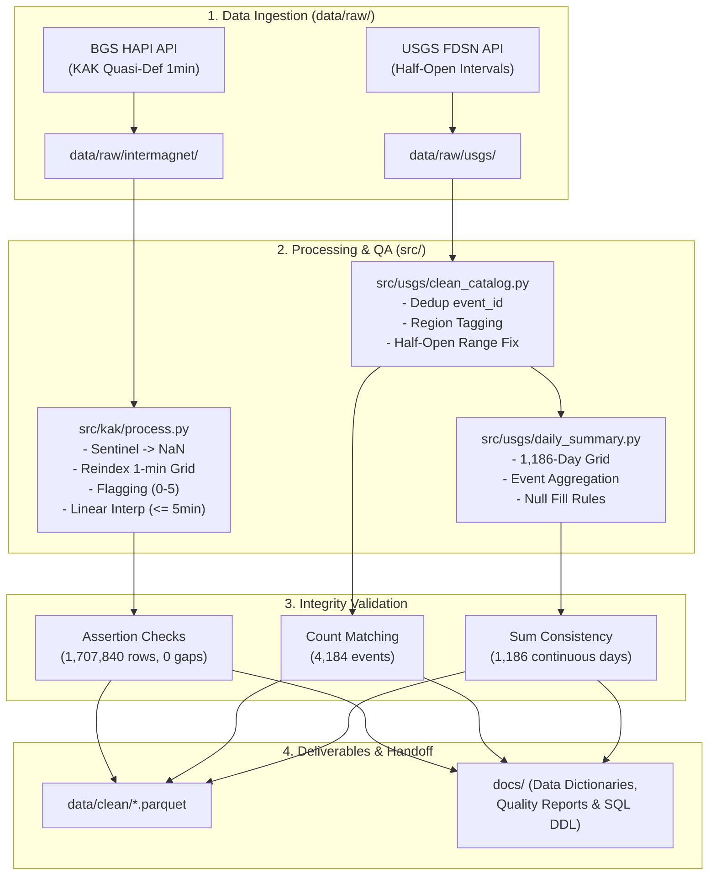

# 🌍 GeoPulse Data Pipeline – KAK & USGS Processing System

Pipeline tự động hóa làm sạch, kiểm chứng chất lượng (Data Quality Control - QC) và tổng hợp dữ liệu địa vật lý đa nguồn (**địa từ trạm KAK - INTERMAGNET** và **động đất khu vực Nhật Bản - USGS**).

> **Phạm vi dữ liệu:** 01/01/2023 – 31/03/2026 (Phủ 1,186 ngày UTC liên tục)  
> **Trạm địa từ KAK:** 1,707,840 mốc thời gian 1 phút (Bảo toàn 100% dòng dữ liệu)  
> **Catalog động đất USGS:** 4,184 sự kiện địa chấn ($M \ge 4.0$) & 1,186 ngày Daily Summary  

---

## 📐 Kiến trúc Luồng Dữ liệu (Data Pipeline Architecture)



---

## 🗂️ Cấu trúc Thư mục Dự án

```text
geopulse-kak-usgs/
├── data/
│   ├── raw/                  # Dữ liệu thô gốc (Chỉ đọc - NEVER MODIFY)
│   │   ├── intermagnet/      # File CSV thô trạm KAK từ HAPI API
│   │   └── usgs/             # File CSV + GeoJSON thô từ USGS API
│   ├── interim/              # Dữ liệu trung gian (QC results & raw parquet)
│   └── clean/                # Dữ liệu sản phẩm chuẩn hóa (.parquet)
├── notebooks/                # Notebook khảo sát & kiểm chứng trực quan (EDA)
│   ├── 01_explore.ipynb      # Khảo sát cấu trúc dữ liệu thô KAK & USGS
│   ├── 02_quality.ipynb      # Kiểm tra 6 chỉ số chất lượng dữ liệu KAK trước xử lý
│   └── 03_clean.ipynb        # Thực thi pipeline KAK, kiểm chứng & xuất báo cáo
├── src/                      # Mã nguồn xử lý tự động (Production Pipeline)
│   ├── config.py             # Cấu hình tham số trung tâm (Paths, Dates, Bounds)
│   ├── common/               # Thư viện dùng chung
│   │   ├── parsers.py        # Parse dữ liệu HAPI CSV & USGS CSV/GeoJSON
│   │   ├── quality_checks.py # 6 thuật toán kiểm tra chất lượng (QC Core)
│   │   └── export.py         # Tiện ích xuất Parquet & tự động sinh tài liệu
│   ├── kak/                  # Pipeline xử lý dữ liệu địa từ KAK (INTERMAGNET)
│   │   ├── download.py       # Tải tự động dữ liệu KAK từ BGS HAPI
│   │   ├── explore.py        # Chạy EDA & báo cáo QC thô KAK
│   │   ├── pipeline.py       # Core pipeline 7 bước xử lý & gắn quality_flag
│   │   └── process.py        # Script thực thi chính cho KAK
│   └── usgs/                 # Pipeline xử lý catalog động đất USGS
│       ├── download.py       # Tải dữ liệu USGS theo năm
│       ├── analyze.py        # Phân tích cấu trúc & phân phối magnitude
│       ├── investigate.py    # Điều tra ranh giới thời gian & tháng đột biến
│       ├── clean_catalog.py  # Xử lý nửa mở, dedup & phân vùng region
│       └── daily_summary.py  # Tổng hợp bảng động đất theo ngày (1,186 ngày)
├── docs/                     # Hệ thống Tài liệu & Từ điển dữ liệu
│   ├── scope.md              # Phạm vi dự án, lựa chọn trạm KAK & USGS bbox
│   ├── kak/
│   │   ├── data_dictionary.md       # Từ điển dữ liệu chi tiết trạm KAK (11 cột)
│   │   └── data_quality_report.md   # Báo cáo QC KAK trước và sau xử lý
│   ├── usgs/
│   │   ├── data_dictionary.md       # Từ điển dữ liệu USGS Catalog & Daily Summary
│   │   └── data_quality_report.md   # Báo cáo QC USGS & lỗi half-open đã sửa
│   └── database/
│       ├── handoff_TV2.md           # Hướng dẫn chi tiết bàn giao nhóm Database (TV2)
│       └── postgres_schema.sql      # Kịch bản DDL PostgreSQL (Tables, Partitions, Views)
├── logs/                     # Nhật ký hệ thống & lịch sử tải
│   ├── download_log.csv      # Log tải KAK (SHA256, File Size, URL)
│   └── usgs_download_log.csv # Log tải USGS theo quý half-open
├── .venv/                    # Môi trường ảo Python
├── requirements.txt          # Danh sách thư viện phụ thuộc
└── README.md                 # Tài liệu hướng dẫn trung tâm
```

---

## ⚡ Hướng dẫn Cài đặt & Vận hành

### 1. Khởi tạo Môi trường

```bash
# Kích hoạt môi trường ảo Python
source .venv/bin/activate

# Cài đặt các thư viện phụ thuộc
pip install -r requirements.txt
```

### 2. Thu thập Dữ liệu Thô (Data Ingestion)

```bash
# Tải dữ liệu địa từ KAK (2023-01-01 -> 2026-03-31)
python src/kak/download.py

# Tải dữ liệu động đất USGS
python src/usgs/download.py
```

### 3. Thực thi Pipeline Làm sạch & Tổng hợp

```bash
# 1. Chạy pipeline làm sạch dữ liệu địa từ KAK
python src/kak/process.py

# 2. Chạy pipeline làm sạch danh mục động đất USGS
python src/usgs/clean_catalog.py

# 3. Tạo bảng tổng hợp động đất theo ngày (Daily Earthquake Summary)
python src/usgs/daily_summary.py
```

### 4. Kiểm tra Khảo sát & Báo cáo Quality

```bash
# Chạy script khảo sát QC KAK
python src/kak/explore.py

# Chạy phân tích & điều tra catalog USGS
python src/usgs/analyze.py
python src/usgs/investigate.py
```

---

## 🎯 Danh mục Sản phẩm Đầu ra (`data/clean/`)

| File Sản phẩm | Số lượng dòng | Kích thước | Mô tả |
| :--- | :---: | :---: | :--- |
| [`clean_intermagnet_KAK_1min_20230101_20260331.parquet`](data/clean/clean_intermagnet_KAK_1min_20230101_20260331.parquet) | **1,707,840** | 20.9 MB | Dữ liệu địa từ 1 phút trạm KAK ($X, Y, Z, F$), tích hợp 6 mã `quality_flag`. Bảo toàn 100% dòng. |
| [`clean_usgs_JP_M4_20230101_20260331.parquet`](data/clean/clean_usgs_JP_M4_20230101_20260331.parquet) | **4,184** | 0.27 MB | Catalog sự kiện động đất $M \ge 4.0$ khu vực Nhật Bản & lân cận, đã dedup `event_id` và gán cờ `region`. |
| [`clean_usgs_JP_M4_daily_20230101_20260331.parquet`](data/clean/clean_usgs_JP_M4_daily_20230101_20260331.parquet) | **1,186** | 23.2 KB | Bảng tổng hợp Daily Earthquake Summary trên lưới ngày UTC liên tục (số lượng sự kiện, max magnitude, độ sâu trung bình). |

---

## 🏷️ Quy định Mã Chất lượng (`quality_flag`)

Mã `quality_flag` cho dữ liệu địa từ KAK được đánh giá theo từng thành phần đo và mã tổng hợp theo quy tắc ưu tiên cờ nghiêm trọng hơn ($5 > 4 > 3 > 2 > 1 > 0$):

| Mã cờ | Phân loại | Mô tả kỹ thuật | Hướng xử lý |
| :---: | :--- | :--- | :--- |
| **0** | **Valid (OK)** | Dữ liệu thô gốc, hợp lệ hoàn toàn | Giữ nguyên giá trị đo |
| **1** | **Interpolated** | Được nội suy tuyến tính từ các gap ngắn ($\le 5$ phút) | Điền giá trị nội suy, gán cờ 1 |
| **2** | **Missing** | Điểm dữ liệu bị thiếu từ gốc hoặc do chuyển Sentinel $99999.00 \rightarrow \text{NaN}$ | Giữ `NaN`, gán cờ 2 |
| **3** | **Spike** | Biến động đột biến bất thường ($|\Delta| > 5.0\sigma$) | **Chỉ gắn cờ**, không sửa/xoá giá trị |
| **4** | **Out of Bounds** | Giá trị vượt dải vật lý hợp lệ theo chuẩn INTERMAGNET / WMM | **Chỉ gắn cờ**, không sửa/xoá giá trị |
| **5** | **Flatline** | Giá trị đứng yên không đổi liên tiếp $\ge 10$ phút | **Chỉ gắn cờ**, không sửa/xoá giá trị |

---

## ⚙️ Cấu hình Tham số Trung tâm (`src/config.py`)

Toàn bộ tham số vận hành được quản lý tập trung tại [src/config.py](src/config.py):
* `DATE_START`, `DATE_END`: Khung thời gian dự án (`2023-01-01` $\rightarrow$ `2026-03-31`).
* `STATIONS`: Trạm địa từ mục tiêu (`["KAK"]`).
* `SENTINEL_VALUES`: Các mã lỗi mặc định HAPI (`[99999.0, 88888.0]`).
* `PHYSICAL_BOUNDS`: Khoảng vật lý hợp lệ từng thành phần ($X: [20k, 50k]$, $Y: [-5k, 10k]$, $Z: [20k, 60k]$, $F: [35k, 65k]$ nT).
* `SPIKE_K`: Ngưỡng độ lệch chuẩn spike ($5.0\sigma$).
* `FLATLINE_N`: Ngưỡng điểm đứng yên tối thiểu ($10$ điểm).
* `INTERP_MAX_GAP`: Độ dài gap tối đa cho phép nội suy ($5$ điểm 1-phút).

---

## 📚 Hệ thống Tài liệu Tham chiếu (`docs/`)

1. **Từ điển Dữ liệu (Data Dictionaries)**:
   - [KAK Data Dictionary](docs/kak/data_dictionary.md): Định nghĩa 11 trường dữ liệu địa từ, kiểu dữ liệu, đơn vị đo nT và bảng mã cờ chất lượng.
   - [USGS Data Dictionary](docs/usgs/data_dictionary.md): Schema 23 trường catalog động đất & 7 trường bảng tổng hợp ngày Daily Summary.
2. **Báo cáo Chất lượng (Quality Reports)**:
   - [KAK Quality Report](docs/kak/data_quality_report.md): Thống kê đối sánh chỉ số QC trước vs. sau xử lý, phân phối cờ chất lượng.
   - [USGS Quality Report](docs/usgs/data_quality_report.md): Phân tích chi tiết lỗi truy vấn half-open interval, thu hồi 37 sự kiện bị thiếu, phân phối magnitude và khu vực `region`.
3. **Cơ sở Dữ liệu & Bàn giao (Database & Handoff)**:
   - [PostgreSQL Schema DDL](docs/database/postgres_schema.sql): Kịch bản SQL tạo bảng, phân vùng theo tháng (Table Partitioning), đánh chỉ mục (Indexes) và tạo Views phục vụ TV2/Power BI.
   - [Handoff TV2 Guide](docs/database/handoff_TV2.md): Hướng dẫn bàn giao kỹ thuật chi tiết cho nhóm Cơ sở dữ liệu và Phân tích.
