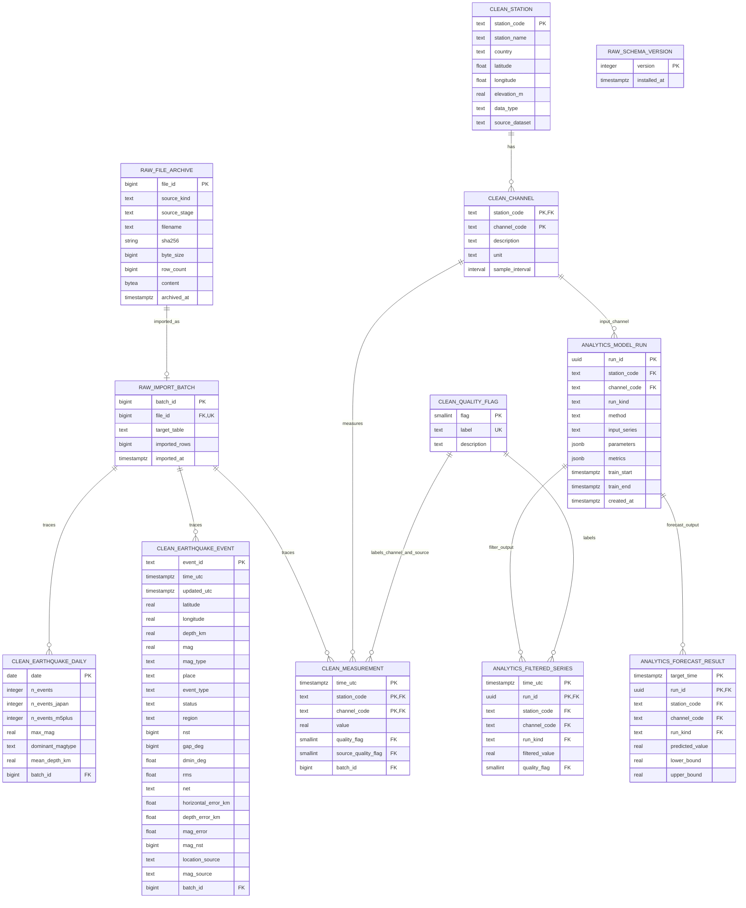

# ERD của CV2

Thiết kế gồm 12 bảng: Raw (3), Clean (6), Analytics (3), chưa tính view và
continuous aggregate. PK/FK trên cùng nhiều cột là khóa ghép. Bảng schema_version
đứng độc lập vì dùng theo dõi phiên bản cấu trúc.

## Sơ đồ đầy đủ các cột

## Giải thích quan hệ

| Quan hệ | Lực lượng | Ý nghĩa |
|---|---|---|
| file_archive → import_batch | 1 → 0..1 | File lưu có thể chưa nhập; file đã nhập có tối đa một batch ở v1 |
| import_batch → measurement / earthquake_event / earthquake_daily | 1 → 0..N | Truy từng bản ghi về đợt nhập và file nguồn |
| station → channel | 1 → 0..N | Một trạm có nhiều kênh; kênh định danh bằng trạm + mã kênh |
| channel → measurement | 1 → 0..N | Một kênh có nhiều số đo theo thời gian |
| quality_flag → measurement | Hai quan hệ 1 → 0..N | Cờ riêng kênh và cờ tổng hợp nguồn cùng tham chiếu danh mục |
| channel → model_run | 1 → 0..N | Một lần chạy thuộc đúng một trạm/kênh |
| model_run → filtered_series / forecast_result | 1 → 0..N | Lưu nhiều điểm đầu ra; chỉ loại run tương ứng được ghi vào mỗi bảng |
| quality_flag → filtered_series | 1 → 0..N | Chất lượng của điểm sau lọc |

Trong mỗi quan hệ, bản ghi con bắt buộc có cha tương ứng. Các cạnh thể hiện
khả năng 0..N của phía cha, không có nghĩa mọi bản ghi cha phải có con.

## Khóa ghép và điều kiện bổ sung

- file_archive UNIQUE `(source_kind,sha256)`; không phải SHA256 duy nhất đơn lẻ.
- channel PK `(station_code,channel_code)`.
- measurement PK `(station_code,channel_code,time_utc)`; không trùng số đo cùng thời điểm.
- model_run UNIQUE `(run_id,station_code,channel_code,run_kind)` là đích của FK ghép ở kết quả.
- filtered_series PK `(run_id,time_utc)`; forecast_result PK `(run_id,target_time)`.
- run_kind ở filtered_series cố định filter; ở forecast_result cố định forecast.

## Những liên kết có chủ đích không đặt FK

Động đất là sự kiện trong vùng nghiên cứu, không phải số đo của KAK. Không
đặt FK từ earthquake_event tới station. earthquake_daily là snapshot thống kê
CV1; đối chiếu theo ngày bằng verify, không FK trực tiếp tới từng event.
Hai nguồn chỉ ghép theo ngày UTC ở view phân tích; không suy ra nhân quả.
model_run.input_series mô tả nguồn đầu vào bằng text; chưa có FK truy lineage
giữa các lần chạy. Khi mở rộng cần thiết kế thêm nếu muốn truy nguồn tự động.

## View và aggregate

clean.kak_1min dựng lại 11 cột CV1 từ measurement, không tạo bản sao vật lý.
measurement_hourly/daily là continuous aggregate; vw_daily_context ghép theo
ngày UTC. Các view không phải thực thể mới nên không vẽ như bảng ở sơ đồ này.

Chi tiết kiểu, NULL và ý nghĩa cột: [DATA_DICTIONARY.md](DATA_DICTIONARY.md).
DDL thực thi: [001_schema.sql](sql/001_schema.sql), [002_timescale.sql](sql/002_timescale.sql).
